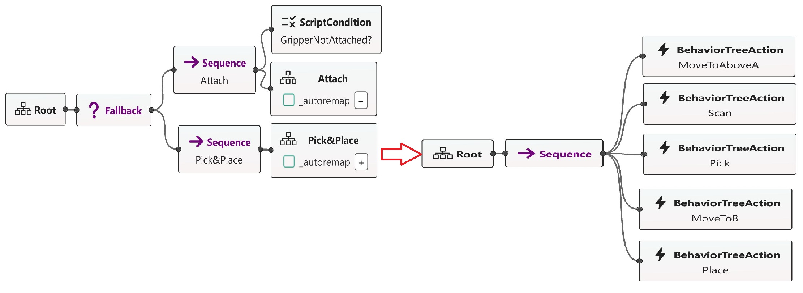

# README #


# Using Behavior Trees in Risk Assessment Data

### What is this repository for? ###

This online Appendix is for the paper: Using Behavior Trees in Risk Assessment.

## Folder Structure: ##


```bash
main
│
├───BTCPP-pick&place (contains the Pick&Place mission created in Groot with the outputs from the FMEA annotated)
│	├──pick_place_robot.xml (The file uses the XML-like language of BehaviorTree.CPP to express the pick&place mission)
├───FMEA-results (contains the applied risk assessment results while developing the approach)
│ ├──Risk_Assment_BT.xlsx (The file contains the outputs of process-FMEA for the pick&place mission)
└───img (figures for the pick&place mission extracted from Groot)
├───Think-Aloud-Task (contains the files shared with the think-aloud participants)
│ ├──ThinkAloud-Tasks.pdf (The file contains the tasks' description shared with the participants)
│ ├──Empty-Risk-Assessment-FMEA.xlsx (The file contains the process-FMEA to be filled by a participant)
├───survey-data (contains the think-aloud survey)
│ ├──Risk-assessment-with-BTs-survey-data.xlsx (The file contains the survey questions and the answers of the external participants)
```
## The Pick&Place mission:
The figure shows the pick&place mission in Groot.


The figure shows the pick&place mission in Groot after integrating the outputs from FMEA. The code for the below figure is [here](/BTCPP-pick%26place/pick_place_robot.xml).


### Who do I talk to? ###
Razan Ghzouli(razan.ghzouli@chalmers.se)
